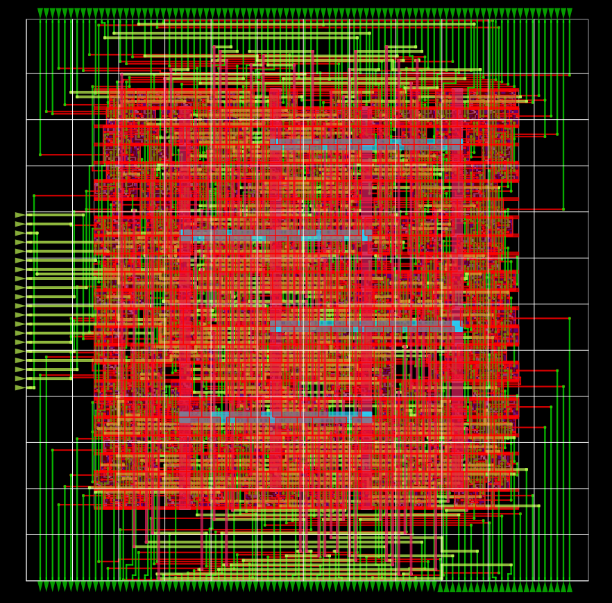
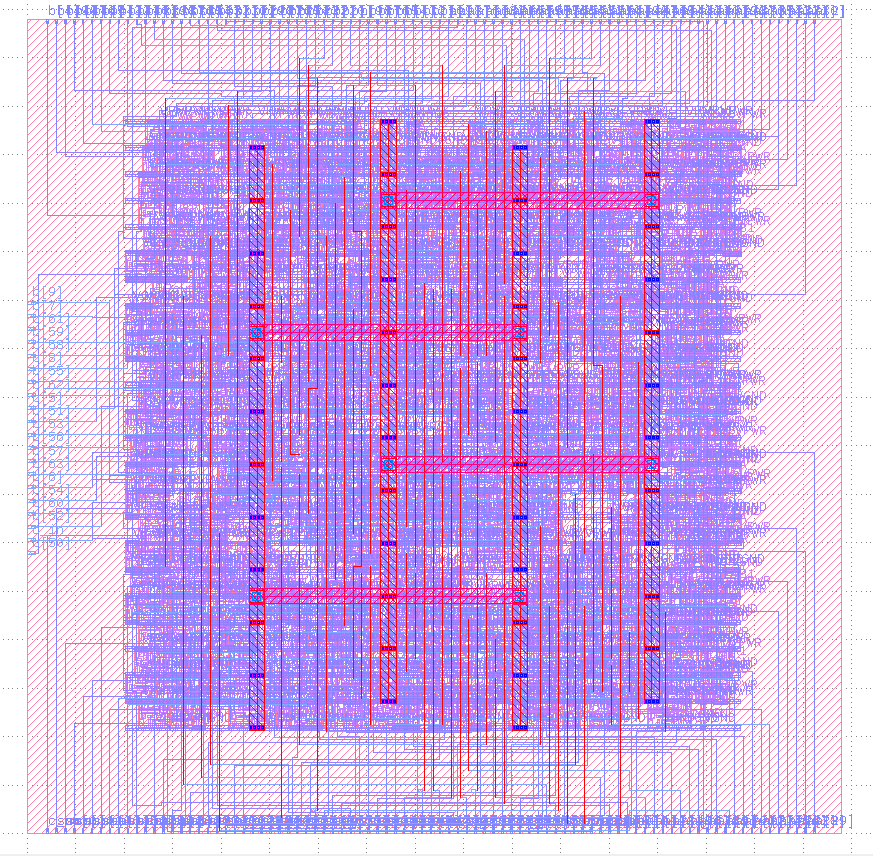
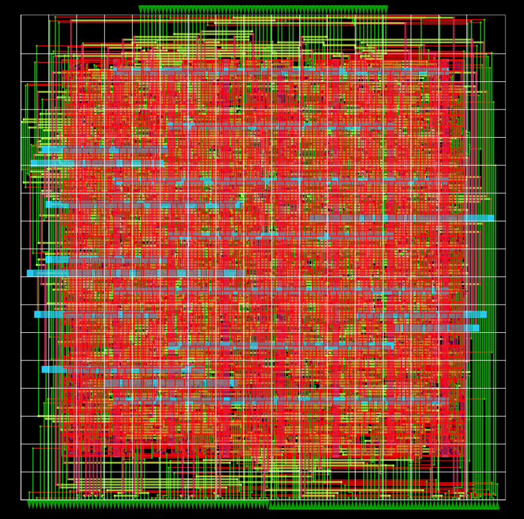
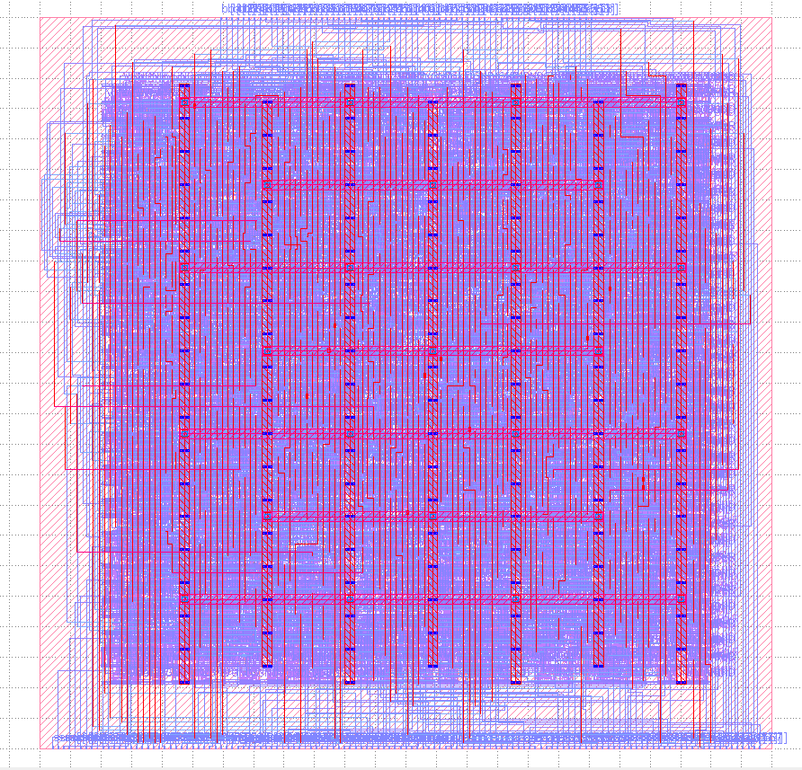

# 🚀 High-Performance Adder Architectures

A study and implementation of high-performance binary adder architectures, focusing on how different carry-computation strategies translate into hardware.

The project implements and characterizes six 64-bit adder architectures:
- Ripple-Carry Adder (RCA)
- Carry-Select Adder (CSA)
- Carry-Bypass Adder (CBA)
- Carry-Lookahead Adder (CLA)
- Kogge-Stone Adder (KSA)
- Brent-Kung Adder (BKA)

The primary characterization uses the `Sky130 HD` standard-cell library, with Nangate45 used for cross-library comparison. Design-space exploration is also performed on selected architectures to study the trade-off between hardware area and timing. 

## 🛠️ Tools & Technologies

## 🏗️ Physical Implementation
Kogge-Stone and Carry-Lookahead were selected for physical implementation to represent the PPA- and timing-oriented architectures, respectively, after Kogge-Stone achieved the lowest ADP and PDP and Carry-Lookahead achieved the lowest critical-path delay in the Sky130HD characterization.

<table align="center">
  <tr>
    <td align="center" style="padding-right: 50px;">
       
         </b> Kogge-Stone Post-Route Physical Layout (OpenROAD)
    </td>
    <td align="center" style="padding-left: 50px;">
       
         </b> Kogge-Stone GDSII Layout (KLayout)
    </td>
  </tr>
</table>
-------------------------------------------------------------------------------------------
<table align="center">
  <tr>
    <td align="center" style="padding-right: 50px;">
       
         </b> Carry-Lookahead Post-Route Physical Layout (OpenROAD)
    </td>
    <td align="center" style="padding-left: 50px;">
       
         </b> Carry-Lookahead GDSII Layout (KLayout)
    </td>
  </tr>
</table>

## 📊 Adders Performance-Analysis
| **Adder Topology**| RCA | CSA | CBA | CLA | KSA | BKA |
|---|---|---|---|---|---|---|
| **Estimated Fmax**| ~40 MHz | ~138.3 MHz | ~41.5 MHz | ~310.6 MHz | ~257.7 MHz | ~77.6 MHz |

  
   
    

## 🔬 Physical Characterization (Sky130HD)
The following table summarizes post-synthesis implementation results obtained using the Sky130 HD standard-cell library.

> Sky130HD

| Module       | Area          | Critical Path | Estimated Fmax | Power    | ADP                 | PDP               |
| ------------ | ------------- | ------------- | -------------- | -------- | ------------------- | ----------------- |
| [RCA](./RCA) | 1761.6896 µm² | 25.00 ns      | ~40 MHz        | 925 µW   | 44042.24 µm²·ns     | 23125 µW·ns       |
| [CSA](./CSA) | 2635.0272 µm² | 7.23 ns       | ~138.3 MHz     | 1580 µW  | 19051.25 µm²·ns     | 11423.4 µW·ns     |
| [CBA](./CBA) | 2875.2576 µm² | 24.09 ns      | ~41.5 MHz      | 1400 µW  | 69264.96 µm²·ns     | 33726 µW·ns       |
| [CLA](./CLA) | 7204.4096 µm² | 3.22 ns       | ~310.6 MHz     | 2590 µW  | 23198.20 µm²·ns     | 8339.8 µW·ns      |
| [KSA](./KSA) | 3080.4544 µm² | 3.88 ns       | ~257.7 MHz     | 1620 µW  | 11952.16 µm²·ns     | 6285.6 µW·ns      |
| [BKA](./BKA) | 2058.2240 µm² | 12.89 ns      | ~77.6 MHz      | 1020 µW  | 26530.51 µm²·ns     | 13147.8 µW·ns     |

> ADP (Area-Delay Product): Area × critical-path delay; lower values indicate better area-timing efficiency.
>
> PDP (Power-Delay Product): Power × critical-path delay; lower values indicate better power-timing efficiency.

### Relative Performance

| Module                | Area vs. RCA | Fmax vs. RCA | Power vs. RCA | ADP vs. RCA | PDP vs. RCA |
| --------------------- | ------------ | ------------ | ------------- | ----------- | ----------- |
| Ripple-Carry Adder    | 1.00×        | 1.00×        | 1.00×         | 1.00×       | 1.00×       |
| Carry-Select Adder    | **1.50×**    | **3.46×**    | **1.71×**     | **0.43×**   | **0.49×**   |
| Carry-Bypass Adder    | 1.63×        | 1.04×        | 1.51×         | 1.57×       | 1.46×       |
| Carry-Lookahead Adder | 4.09×        | **7.77×**    | 2.80×         | **0.53×**   | **0.36×**   |
| Kogge-Stone Adder     | 1.75×        | **6.44×**    | 1.75×         | **0.27×**   | **0.27×**   |
| Brent-Kung Adder      | 1.17×        | **1.94×**    | 1.10×         | **0.60×**   | **0.57×**   |

### Architecture Characterization

The 64-bit adder architectures were synthesized and analyzed across different
architectural parameters to study area, timing, and PPA tradeoffs.

- [CLA Block Width Study](https://github.com/KARAN-D05/High-Performance-Adder-Architectures/tree/main/CLA#block-width-study)
- [CSA Block Width Study](https://github.com/KARAN-D05/High-Performance-Adder-Architectures/tree/main/CSA#block-width-study)
- [CBA Block Width Study](https://github.com/KARAN-D05/High-Performance-Adder-Architectures/tree/main/CBA#block-width-study)

  
   
  Maximum combinational delay vs. Area vs. CLA block width

## 🔬 Physical Characterization (Nangate45)
The following table summarizes post-synthesis implementation results obtained using the Nangate45 standard-cell library.
> Nangate45

| Module       | Area         | Critical Path | Estimated Fmax | Power  | ADP            | PDP          |
| ------------ | ------------ | ------------- | -------------- | ------ | -------------- | ------------ |
| RCA          | 391.552 µm²  | 2.10 ns       | ~476.2 MHz     | 246 µW | 822.26 µm²·ns  | 516.6 µW·ns  |
| CSA          | 519.764 µm²  | 1.11 ns       | ~900.9 MHz     | 446 µW | 577.94 µm²·ns  | 495.06 µW·ns |
| CBA          | 551.152 µm²  | 2.90 ns       | ~344.8 MHz     | 330 µW | 1598.34 µm²·ns | 957 µW·ns    |
| CLA          | 1441.188 µm² | 0.85 ns       | ~1176.5 MHz    | 729 µW | 1225.01 µm²·ns | 618.65 µW·ns |
| KSA          | 653.296 µm²  | 0.95 ns       | ~1052.6 MHz    | 462 µW | 620.63 µm²·ns  | 438.90 µW·ns |
| BKA          | 416.556 µm²  | 1.83 ns       | ~546.4 MHz     | 285 µW | 762.30 µm²·ns  | 521.55 µW·ns |

### Relative Performance

| Module                | Area vs. RCA | Fmax vs. RCA | Power vs. RCA | ADP vs. RCA | PDP vs. RCA |
| --------------------- | ------------ | ------------ | ------------- | ----------- | ----------- |
| Ripple-Carry Adder    | 1.00×        | 1.00×        | 1.00×         | 1.00×       | 1.00×       |
| Carry-Select Adder    | 1.33×        | 1.89×        | 1.81×         | 0.70×       | 0.96×       |
| Carry-Bypass Adder    | 1.41×        | 0.72×        | 1.34×         | 1.94×       | 1.85×       |
| Carry-Lookahead Adder | 3.68×        | 2.47×        | 2.96×         | 1.49×       | 1.20×       |
| Kogge-Stone Adder     | 1.67×        | 2.21×        | 1.88×         | 0.76×       | 0.85×       |
| Brent-Kung Adder      | 1.06×        | 1.15×        | 1.16×         | 0.93×       | 1.01×       |

# 📜License
- Source code and HDL files are licensed under the MIT License.
- Documentation, diagrams, images, and PDFs are licensed under Creative Commons Attribution 4.0 (CC BY 4.0).
